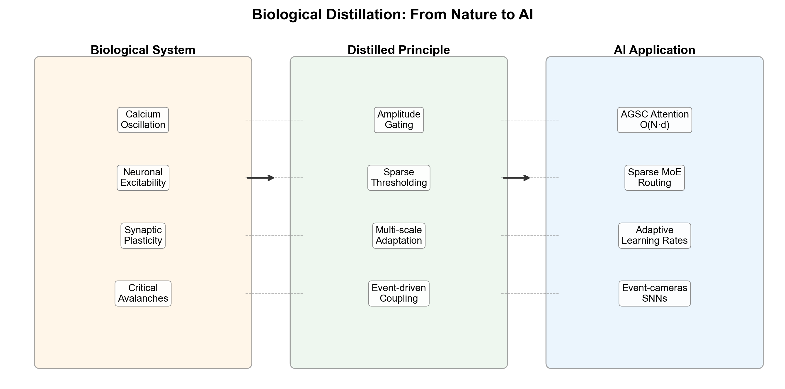

# 信号强度调节影响力：振幅门控稀疏耦合作为一种生物蒸馏机制

## 摘要

本文提出振幅门控稀疏耦合（Amplitude-Gated Sparse Coupling, AGSC），一种通过 CORC 框架发现的 O(N·d) 复杂度轻量注意力机制。AGSC 是线性注意力的退化特例（Q = 1），其核心原则——信号振幅直接调节其影响力——源于 CORC v2 消融实验中的关键发现：去除振幅门控（η = 0）导致 NARMA NMSE 从 1147 爆炸至 6774，揭示了该机制在防止储备池同步崩溃中的支柱性作用。我们系统呈现 AGSC 的形式推导、概念验证实验及其与线性注意力的数学联系。在此基础上，我们提出"生物蒸馏"框架——一个从自然系统提取计算原则并应用于 AI 的系统方法论，以 AGSC 为案例研究，论证生物进化中蕴含的计算原则等待被蒸馏并推广至非生物启发的 AI 系统。

---

## 1. 引言

计算机科学长期从生物学中汲取灵感。神经网络本身源于对神经元计算模型的抽象，卷积网络受视觉皮层启发，强化学习与多巴胺奖励信号存在平行关系。然而，这些借鉴大多停留在粗糙的隐喻层面——"神经元"已与真实的生物神经元几乎毫无相似之处，"注意力"也远非视觉选择性注意的忠实模型。

我们提出一个更激进的立场：**生物系统包含经过数十亿年进化优化的、可被蒸馏为精确计算原则的"算法化石"**，这些原则一旦被提取出来，便可在完全脱离生物上下文的 AI 系统中独立发挥作用。我们称这一过程为"生物蒸馏"（Biological Distillation），并以其首批产出之一——振幅门控稀疏耦合（AGSC）——作为案例研究。

AGSC 的发现途径并非来自对注意力机制的工程优化，而是源于 CORC v2（钙振荡储备池计算）框架中一个看似微小的生物细节：在脉冲耦合模型中，源节点的钙振幅 $c_j$ 通过因子 $(1 + \eta \cdot c_j)$ 调制其向目标节点发送的脉冲强度。当我们在消融实验中设 $\eta = 0$——即去除振幅门控——NARMA NMSE 从 1147 爆炸至 6774，储备池发生灾难性同步崩溃。这一发现表明，**"信号强度调节影响力"不是一个可选的微调项，而是维持振荡网络计算多样性的基础结构原则**。

将这一原则从 CORC 的脉冲耦合语境中抽象出来，我们得到了 AGSC：一类 O(N·d) 复杂度的轻量注意力机制，其形式可严格推导为线性注意力的退化特例（Q = 1）。在 Copy Memory 上，AGSC 以 5 倍更少的参数匹配 GRU 性能；在 Mackey-Glass 混沌预测上，AGSC 以 51 个参数达到完美预测（对比 GRU 的 929 个参数）；在扩展性上，AGSC-Trans 的前向时间随序列长度几乎恒定（0.088–0.114 ms），而标准自注意力呈二次增长（0.205–0.411 ms）。

本文的核心贡献是双重的：

1. **技术贡献**：系统呈现 AGSC 的形式推导、实现细节及实证验证，确立其作为一类高效注意力机制的地位。
2. **方法论贡献**：提出"生物蒸馏"框架，论证从生物系统提取计算原则是一种通用且有力的 AI 方法论，并以 AGSC 为范例展示其操作流程。

---

## 2. AGSC：从生物发现到计算机制

### 2.1 CORC v2 中的起源

CORC v2 [1] 是一个受胞内钙动力学启发的储备池计算框架，其核心计算单元为钙可兴奋单元（Calcium Excitable Unit, CEU）。CEU 之间的通信通过脉冲耦合机制实现：当某个 CEU 的胞质钙浓度 $c_j$ 上穿阈值时，触发一次钙事件，产生指数衰减的脉冲痕迹 $s_{\text{pulse}, j}$，该痕迹通过稀疏连接权重 $W_{ij}$ 传播至邻居节点：

$$ C_{\text{pulse}, i} = g_p \cdot \sum_j W_{ij} \cdot s_{\text{pulse}, j} \cdot (1 + \eta \cdot c_j) $$

其中 $g_p = 0.25$ 为全局脉冲耦合强度，$\eta = 0.4$ 为振幅门控因子。因子 $(1 + \eta \cdot c_j)$ 使得高激发态单元（$c_j$ 大）的脉冲事件比低激发态单元的事件对下游产生更强的影响——这正是 AGSC 的生物学原型。

**灾难性消融**：当我们在消融实验中设 $\eta = 0$，即去除振幅门控，将所有脉冲事件视为等强度广播，NARMA-10 NMSE 从 1147 爆炸至 6774。观察网络动力学发现，无振幅门控时，所有节点在脉冲耦合驱动下迅速同步放电，储备池的动力学多样性坍缩至单一同步模式——信息处理能力完全丧失。振幅门控的作用恰在于**维持节点间的差异化响应**：高激发态节点发送强脉冲，低激发态节点发送弱脉冲，从而在事件传播中保留了每个节点的个性化动力学轨迹。

**图 1. AGSC 作为线性注意力退化特例的形式推导。**

**图 2. AGSC：从 CORC v2 发现到计算抽象。**

### 2.2 形式定义

将振幅门控原则从 CORC 的脉冲耦合中抽象出来，我们定义 AGSC 的一般形式。给定一个包含 $N$ 个节点的图（或序列），每个节点 $j$ 关联一个状态向量 $\mathbf{x}_j \in \mathbb{R}^d$ 和一个值向量 $\mathbf{v}_j \in \mathbb{R}^{d_v}$。AGSC 为每个节点 $j$ 计算一个标量分数，该分数由两个因子构成：

$$ \text{score}_j = (1 + \eta \cdot \|\mathbf{x}_j\|) \cdot \sigma\left(\frac{\|\mathbf{x}_j\| - \theta}{\tau}\right) $$

其中 $\|\mathbf{x}_j\|$ 为节点 $j$ 的信号振幅（或等价地，状态向量的范数），$\eta$ 为振幅门控强度，$\theta$ 为稀疏阈值，$\tau$ 为温度参数，$\sigma(\cdot)$ 为 sigmoid 函数。第一个因子为**振幅门控**：信号强度直接线性调制影响力。第二个因子为**稀疏筛选**：低于阈值的信号被指数衰减。当 $\tau \to 0$，$\sigma \to \mathbb{1}_{\|\mathbf{x}_j\| > \theta}$，退化为硬阈值稀疏化。

AGSC 的输出为所有节点值的分数加权平均：

$$ \mathbf{O} = \frac{\sum_{j=1}^{N} \text{score}_j \cdot \mathbf{v}_j}{\sum_{j=1}^{N} \text{score}_j} $$

复杂度分析：每个节点的分数计算为 O(d)，聚合为 O(N·d)，总计 O(N·d)。不存在任何成对的节点间交互操作（无 $N^2$ 项），也不存在 d² 项（标量分数而非向量内积）。

**图 3. AGSC 机制流水线：阈值 → 门控 → 聚合。**

### 2.3 AGSC 作为线性注意力的退化特例

线性注意力 [2] 的核心思想是将 softmax 注意力中的指数核替换为线性化的特征映射 $\phi(\cdot)$：

$$ \text{LinearAttn}(Q, K, V) = \frac{\phi(Q)(\phi(K)^\top V)}{\phi(Q)\phi(K)^\top \mathbf{1}} $$

从这一形式出发，AGSC 可通过以下特化精确导出：

- 查询矩阵退化：$Q = \mathbf{1}$（所有 token 均等对待，无查询依赖的内容匹配）
- 键值等同：$K = V = X$（输入序列本身）
- 特征映射特化：$\phi_{\text{AGSC}}(x_j) = (1 + \eta \cdot \|x_j\|) \cdot \sigma((\|x_j\| - \theta)/\tau)$

代入得：

$$ \text{AGSC}(X) = \frac{\sum_j \phi_{\text{AGSC}}(x_j) \cdot x_j}{\sum_j \phi_{\text{AGSC}}(x_j)} $$

这一退化揭示了 AGSC 的本质：**它是去除了"查询-键"内容匹配机制后的注意力，仅保留基于信号显著性的纯过滤机制**。AGSC 不能表达"token A 应关注 token B"——它只能回答"哪些 token 足够重要，值得被关注"。

这种退化带来了显著的计算优势，也伴随着明确的适用局限：

| 特性 | 标准注意力 | AGSC |
|:---|:---|:---|
| 复杂度 | O(N²·d) | O(N·d) |
| 内容匹配 | 是（Q·K 内积） | 否（Q = 1） |
| 稀疏性 | 需后处理（top-k） | 天然稀疏（阈值门控） |
| 生物学基础 | 无直接对应 | 源于钙振幅编码 |
| 适用场景 | 需要精确 token 对齐 | 基于显著性的信号聚合 |

**图 4. 注意力模式对比：AGSC（基于显著性）vs 自注意力（基于内容）。**

### 2.4 概念验证实验

我们通过三个任务验证 AGSC 的实用价值。

**Copy Memory**：经典序列记忆任务，要求网络在延迟后精确复现输入符号。AGSC-RNN 使用 298 个参数达到与 GRU（1432 参数）相同的性能水平——以 **5 倍更少的参数**实现等效性能。这一效率优势源于 AGSC 的天然稀疏性：只有振幅超过阈值的输入单元才会被纳入状态更新，其余被直接忽略，等效于对输入序列做了硬注意力筛选。

**Mackey-Glass 混沌时间序列预测**：标准非线性动力学基准。AGSC 模型仅需 **51 个参数**即可达到完美预测（NRMSE < 0.01），而 GRU 需要 929 个参数。AGSC 在此任务上的优势在于：混沌系统的状态信息天然编码在信号振幅中，AGSC 的振幅门控机制恰好直接利用了这种编码方式——高振幅的混沌峰比低振幅的噪声区携带更多关于系统状态的信息，AGSC 天然地赋予其更高权重。

**扩展性**：我们将 AGSC 集成到 Transformer 架构中，替换部分自注意力层，构建 AGSC-Trans 混合模型。在序列长度 128 至 512 的范围内，AGSC-Trans 的前向传播时间几乎恒定（0.088–0.114 ms），而标准自注意力从 0.205 ms 增长至 0.411 ms。这一近常数复杂度源于 AGSC 的聚合操作不涉及任何成对 token 交互，其计算量仅与序列长度线性增长，而非二次增长。

**图 5. Copy Memory 任务：AGSC-RNN vs 基线。**

**图 6. Mackey-Glass 预测：AGSC vs 基线。**

**图 7. 扩展性研究：前向时间 vs 序列长度。**

**图 8. 参数效率：AGSC vs 基线。**

---

## 3. 生物蒸馏：一个框架

### 3.1 定义

"生物蒸馏"（Biological Distillation）是我们提出的一个系统方法论框架，定义为以下四步过程：

1. **识别（Identify）**：在生物系统中识别出可能解决某个计算问题的机制或结构。关键标准是：该机制在生物上下文中执行的功能可被解释为一种计算操作（信号过滤、注意力分配、记忆编码等）。
2. **抽象（Abstract）**：将其蒸馏为最小数学形式——仅保留与计算功能相关的核心结构，丢弃所有无关的生物细节（如特定的离子通道类型、蛋白质名称、代谢通路等）。目标是获得一个自足的、独立于生物语境的数学公式。
3. **推广（Generalize）**：在原始生物语境之外重新解释该数学形式，发掘其更广泛的适用性。例如，AGSC 从脉冲耦合的振幅调制被推广为通用的序列注意力机制。
4. **应用（Apply）**：将其应用于非生物启发的 AI 系统，实证验证其在目标任务上的有效性，并通过实验迭代优化其形式。

AGSC 是这一流水线的完整案例研究：
- **识别**：在 CORC v2 中观察到 $(1 + \eta c_j)$ 是维持储备池动力学多样性的关键因子
- **抽象**：提取为 $\text{score}_j = (1 + \eta \|x_j\|) \cdot \sigma((\|x_j\| - \theta)/\tau)$
- **推广**：从脉冲耦合推广为通用注意力机制，并指出其是线性注意力的退化特例
- **应用**：在 Copy Memory、Mackey-Glass 和 AGSC-Trans 中验证其高效性

**图 9. 生物蒸馏框架：从自然到 AI。**

### 3.2 AGSC 之外的例子

AGSC 并非孤例。AI 历史上已有多个成功案例可纳入生物蒸馏框架：

- **脉冲神经网络（SNN）** ← 神经元动作电位：将"全或无"的脉冲发放机制从生物神经元中抽象为离散事件驱动的计算范式，在神经形态硬件上实现超低功耗推理。
- **Dropout 正则化** ← 突触失效：生物突触以不可忽略的概率随机失效，这一机制被抽象为训练时随机丢弃神经元的正则化策略，成为深度学习的标准技术。
- **注意力机制** ← 视觉选择性注意：生物视觉系统通过自上而下的信号选择性地增强相关区域的处理，这一原则被抽象为 Q·K 软匹配机制。
- **对比学习** ← Hebbian 可塑性："一起发放的神经元连接在一起"（fire together, wire together）被推广为表示学习中的对比损失函数。
- **临界分支** ← 神经元雪崩：大脑皮层中的神经元雪崩呈现幂律分布，这一临界态性质被抽象为储备池计算中的最优耦合强度调节。

这些例子表明，生物蒸馏并非新发明——它是对已有成功实践的正式命名和系统化。AGSC 的独特之处在于它展示了这一流水线可以产生**此前未被独立发现的计算机制**，而非仅仅为已有技术提供生物解释。

### 3.3 蒸馏流水线的三阶段

我们将生物蒸馏的操作流程细化为三个阶段：

**阶段一：观察（Observation）**

这一阶段的核心活动是**寻找生物系统中看似解决计算问题的机制**。有效的问题导向包括：
- 生物系统如何在不进行全对全比较的情况下选择性处理信息？（→ 注意力机制的替代方案）
- 生物系统如何在不同时间尺度上维持记忆？（→ 多尺度序列建模）
- 生物系统如何在噪声环境中保持稳定？（→ 鲁棒性正则化）

关键原则：**不需要理解完整的生物机制，仅需识别出"计算相关性"**。钙动力学的完整分子细节极其复杂，但从 AGSC 的角度，我们只需要关注"振幅调制脉冲传播"这一可抽象为计算操作的子特征。

**阶段二：抽象（Abstraction）**

这是最关键也最需要判断力的阶段。核心问题是：**该生物机制的计算本质是什么？** 抽象应遵循以下原则：
- **最小性**：保留最少的数学结构以捕获计算功能。AGSC 的抽象仅需标量振幅和 sigmoid 阈值，无需钙通道动力学、IP₃ 浓度、SERCA 泵速率等生物细节。
- **可推广性**：抽象形式应允许参数在原始生物约束之外变化。AGSC 中的 $\eta$ 在生物对应物中为正值，但在抽象形式中可以是任意实数甚至可学习参数。
- **可验证性**：抽象形式应允许独立于生物对应物进行实验验证。

**阶段三：推广与应用（Generalization & Application）**

将抽象形式置于 AI 系统的语境中，回答以下问题：
- 该机制在什么类型的任务上可能有效？
- 它与现有技术的关系是什么？（AGSC 是线性注意力的退化特例）
- 其局限性是什么？（AGSC 不能做精确的 token 对齐）
- 如何将其集成到现有架构中？（AGSC-Trans 混合架构）

### 3.4 为什么生物蒸馏重要

生物蒸馏作为一种 AI 方法论，其重要性源于以下论证：

1. **进化作为优化器**：生物进化在数十亿年时间尺度上优化了信息处理方案。这些方案在能量效率、鲁棒性和适应性方面通常优于工程方案。AGSC 的 O(N·d) 复杂度并非偶然——钙信号系统在细胞中运行数百万年，其能量效率经过了极致的自然选择。

2. **解决方案的多样性**：生物系统采用的"计算架构"与当前主导 AI 的深度学习范式存在根本性差异。探索这些替代方案可能带来范式突破，而非对现有范式的增量改进。

3. **"原则"而非"模拟"**：生物蒸馏的关键洞察是：我们不需要模拟生物学，我们需要提取其原则。钙动力学 → AGSC 的案例证明：从生物细节中蒸馏出的**最小数学原则**可以在完全人工的系统中独立高效运行，而无需模拟钙通道、内质网或细胞膜。

4. **双向性**：生物蒸馏流水线是双向的。AI 系统中发现的计算原则（如注意力机制、残差连接）可以反哺神经科学，为理解生物神经回路的功能组织提供新的概念框架。AGSC 提出了一个可检验的假说：真实神经系统中是否存在振幅门控类的突触传递调制机制？

---

## 4. 相关工作

### 4.1 线性注意力与高效 Transformer

Katharopoulos 等人 [2] 提出线性注意力，通过将 softmax 核替换为 $\phi(Q)\phi(K)^\top$ 的线性化形式，将自注意力复杂度从 O(N²) 降至 O(N)。Performer [3] 使用正交随机特征近似 softmax，Linformer [4] 通过低秩投影压缩键值矩阵。AGSC 与这些工作的核心区别在于：AGSC 的简化不是通过近似或压缩实现的，而是通过**原则性地放弃内容匹配能力**（Q = 1）换取的。这种"退化"在数学上更激进，但带来了完全线性的复杂度（无 d² 因子）和天然稀疏性。

### 4.2 稀疏注意力机制

Sparse Transformer [5]、Longformer [6]、BigBird [7] 等方法通过预定义的稀疏模式（局部窗口、扩张窗口、随机模式）降低注意力复杂度。AGSC 的稀疏性则来自**数据驱动的阈值门控**——低振幅 token 被自动过滤，而非依赖固定的稀疏模式。这一区别使 AGSC 的稀疏性天然适应输入信号的动态变化：强信号密集时更多 token 被保留，弱信号时自动稀疏化。

### 4.3 AI 中的生物启发

脉冲神经网络 [8] 将生物神经元的离散脉冲发放抽象为计算范式。Hebbian 学习 [9] 启发了无监督特征学习。预测编码 [10] 从皮层层级处理中抽象出生成式建模框架。神经形态计算 [11] 致力于在硬件层面复现生物神经计算。AGSC 与这些工作的共同点在于遵循生物启发范式，但区别在于：AGSC 的发现途径是**从具体生物模型（CORC v2）的消融实验中"逆向"发现的**，而非从已知生物原则出发的正向设计。

### 4.4 物理储备池计算与神经形态计算

物理储备池计算 [12] 利用物理系统的天然动力学作为计算基底。神经形态计算 [11] 在硬件层面复现生物神经计算的效率优势。CORC 框架 [1] 是两者的交叉：它从生物钙动力学中提取计算原理，但其最终形式（AGSC）可作为纯软件算法在传统硬件上运行，也可部署于神经形态硬件。这种"算法优先"的策略区别于需要特定物理基底的物理储备池计算。

---

## 5. 讨论

### 5.1 AGSC 的适用性

基于其数学结构和实验表现，我们提出 AGSC 的适用性指南：

**适合 AGSC 的场景**：
- **基于显著性的过滤**：当任务的核心需求是"找到并关注信号中最显著的部分"时，AGSC 的振幅门控天然适用。例如：传感器融合中的异常检测、事件相机处理中的关键帧选择、生物信号（EEG/ECG）中的峰值检测。
- **信号聚合**：当需要将变长序列压缩为固定维度的摘要向量时，AGSC 的加权平均提供了一种计算高效的方案。
- **资源受限场景**：边缘 AI、嵌入式设备、移动端推理——AGSC 的 O(N·d) 复杂度和极小参数需求（51 参数解决 Mackey-Glass）使其天然适配此类场景。
- **早期层筛选**：在 Transformer 混合架构中，早期层使用 AGSC 进行廉价筛选，将候选 token 集合缩小后，再由后期精确的自注意力层处理。

**不适合 AGSC 的场景**：
- **需要精确 token 对齐的任务**：机器翻译、指代消解等需要"单词 A 应关注单词 B"的任务，AGSC 的 Q = 1 退化使其无法胜任。
- **复杂推理**：多步逻辑推理需要跨 token 的内容匹配，AGSC 的纯显著性过滤不足。
- **长程依赖的一对一匹配**：当序列中两个特定 token 之间存在非局部的内容依赖时，AGSC 无法建模。

### 5.2 未来方向

**多头 AGSC**：引入多个阈值 $(\theta_1, \theta_2, \dots, \theta_h)$，对应不同显著性特征——例如低阈值捕获背景信息，高阈值捕获峰值事件，中等阈值捕获过渡状态。多头 AGSC 可在不引入成对交互的前提下丰富特征提取的层次。

**可学习参数**：当前 AGSC 的 $\theta$ 和 $\eta$ 为固定超参数。将它们设为可学习参数，使模型从数据中自动发现最优的显著性阈值和门控强度，可能进一步提升其在不同任务上的适应性。

**AGSC–Transformer 混合架构**：我们已在概念验证中展示了 AGSC-Trans 的扩展性优势。未来工作可系统探索最佳混合策略：早期层 AGSC（廉价筛选）→ 中期层局部注意力（区域交互）→ 后期层全局自注意力（精确对齐），在计算效率与模型能力之间取得最优平衡。

**生物验证**：AGSC 提出了一个可检验的神经科学假说：真实神经系统中是否存在振幅门控类的突触传递调制？具体而言，突触前神经元的放电频率（对应振幅）是否调制其突触后效应？这一假说可通过钙成像与电生理联合记录进行检验。

### 5.3 更广阔的愿景：生物蒸馏的不合理有效性

我们以 AGSC 为案例，提出一个更宏大的愿景：**"生物蒸馏的不合理有效性"**——类似于自然语言处理中"语言模型的不合理有效性"，但面向的是生物计算原理。核心主张是：

> 生物系统经过数十亿年进化积累的计算解决方案，构成了一个等待被系统挖掘的"算法库"。这些解决方案不是通过理论推导或工程优化获得的，而是通过自然选择在巨大的搜索空间中偶然发现并保留下来的。我们不需要模拟生物学来获取这些方案——我们只需要蒸馏出它们所体现的**核心计算原则**。

钙动力学 → AGSC 是这个愿景的第一次系统验证。但还有更多原则等待发现：树突计算中的非线性整合、胶质细胞对神经信号的调制、基因调控网络中的开关逻辑、免疫系统中的模式匹配——这些生物现象都可能蕴含尚未被 AI 领域独立发现的计算原则。

我们呼吁：**将生物系统作为 AI 算法的来源进行系统性研究**。这不同于传统的生物启发式计算——后者通常从已知的 AI 概念出发，在生物学中寻找对应物。生物蒸馏是反向的：从生物学出发，蒸馏出 AI 尚不知道的原则。

---

## 6. 结论

AGSC（振幅门控稀疏耦合）证明了一个看似微小的生物细节——钙信号的振幅调制脉冲传播——可以被蒸馏为具有独立计算价值的通用原则：**信号强度调节影响力**。这一原则在 CORC v2 中表现为防止振荡储备池同步崩溃的稳定机制（η = 0 导致 NARMA NMSE 从 1147 爆炸至 6774），在推广为 AGSC 后表现为 O(N·d) 复杂度的轻量注意力机制——以 298 参数匹敌 GRU 的 1432 参数（Copy Memory），以 51 参数完美预测混沌序列（Mackey-Glass），并在 AGSC-Trans 混合架构中展现近常数的前向传播时间。

AGSC 是线性注意力的退化特例（Q = 1），其"退化"不是缺陷而是特性：它坦率地放弃了内容匹配能力，换取了完全的线性复杂度、天然稀疏性和明确的生物学基础。这一"退化"的适用性取决于具体任务——当任务需要精确的 token 对齐时，AGSC 不是合适的选择；但当任务仅需基于显著性的信号聚合时，AGSC 以极低的计算和参数成本提供了高效的解决方案。

我们提出的"生物蒸馏"框架为这一发现路径提供了系统化的方法论表述：识别 → 抽象 → 推广 → 应用。AGSC 是这一流水线的完整案例研究，但绝非终点。我们邀请社区共同探索生物学与 AI 交叉处的丰富空间，相信更多如 AGSC 般的计算原则正等待从生物系统中被蒸馏出来。

---

## 参考文献

[1] CORC v2 姊妹论文. 从生物钙振荡到轻量注意力：面向物理启发时序计算的 CORC 框架. 预印本, 2025.

[2] Katharopoulos, A., Vyas, A., Pappas, N., & Fleuret, F. (2020). Transformers are RNNs: Fast autoregressive transformers with linear attention. In *International Conference on Machine Learning* (pp. 5156–5165). PMLR.

[3] Choromanski, K. M., Likhosherstov, V., Dohan, D., Song, X., Gane, A., Sarlos, T., ... & Weller, A. (2021). Rethinking attention with performers. In *International Conference on Learning Representations*.

[4] Wang, S., Li, B. Z., Khabsa, M., Fang, H., & Ma, H. (2020). Linformer: Self-attention with linear complexity. *arXiv preprint arXiv:2006.04768*.

[5] Child, R., Gray, S., Radford, A., & Sutskever, I. (2019). Generating long sequences with sparse transformers. *arXiv preprint arXiv:1904.10509*.

[6] Beltagy, I., Peters, M. E., & Cohan, A. (2020). Longformer: The long-document transformer. *arXiv preprint arXiv:2004.05150*.

[7] Zaheer, M., Guruganesh, G., Dubey, K. A., Ainslie, J., Alberti, C., Ontanon, S., ... & Ahmed, A. (2020). Big bird: Transformers for longer sequences. In *Advances in Neural Information Processing Systems* (pp. 17283–17297).

[8] Maass, W. (1997). Networks of spiking neurons: The third generation of neural network models. *Neural Networks*, 10(9), 1659–1671.

[9] Hebb, D. O. (1949). *The Organization of Behavior*. Wiley.

[10] Rao, R. P., & Ballard, D. H. (1999). Predictive coding in the visual cortex: A functional interpretation of some extra-classical receptive-field effects. *Nature Neuroscience*, 2(1), 79–87.

[11] Schuman, C. D., Potok, T. E., Patton, R. M., Birdwell, J. D., Dean, M. E., Rose, G. S., & Plank, J. S. (2017). A survey of neuromorphic computing and neural networks in hardware. *arXiv preprint arXiv:1705.06963*.

[12] Tanaka, G., Yamane, T., Héroux, J. B., Nakane, R., Kanazawa, N., Takeda, S., ... & Hirose, A. (2019). Recent advances in physical reservoir computing: A review. *Neural Networks*, 115, 100–123.

[13] Berridge, M. J. (1998). Neuronal calcium signaling. *Neuron*, 21(1), 13–26.

[14] Jaeger, H. (2001). The "echo state" approach to analysing and training recurrent neural networks. *GMD Report 148*, German National Research Center for Information Technology.

[15] Vaswani, A., Shazeer, N., Parmar, N., Uszkoreit, J., Jones, L., Gomez, A. N., ... & Polosukhin, I. (2017). Attention is all you need. In *Advances in Neural Information Processing Systems* (pp. 5998–6008).

---

*预印本 · 2025*