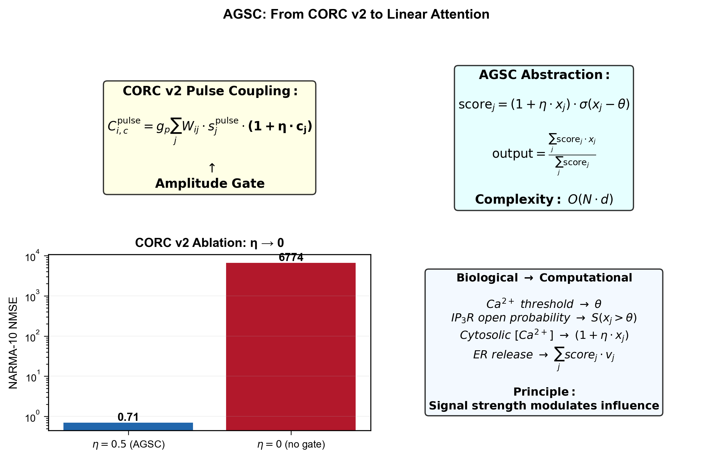
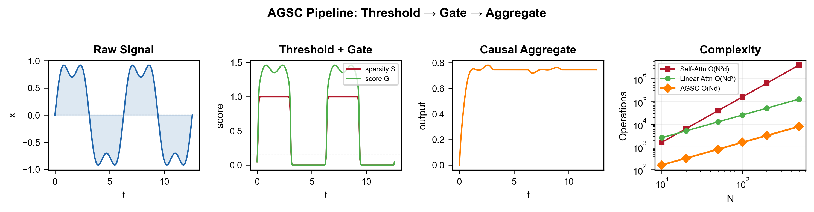
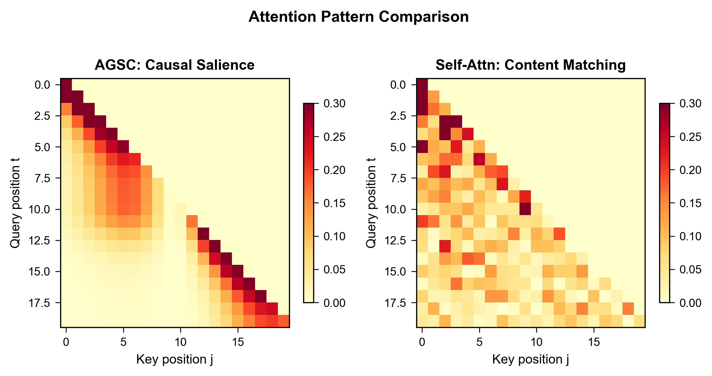
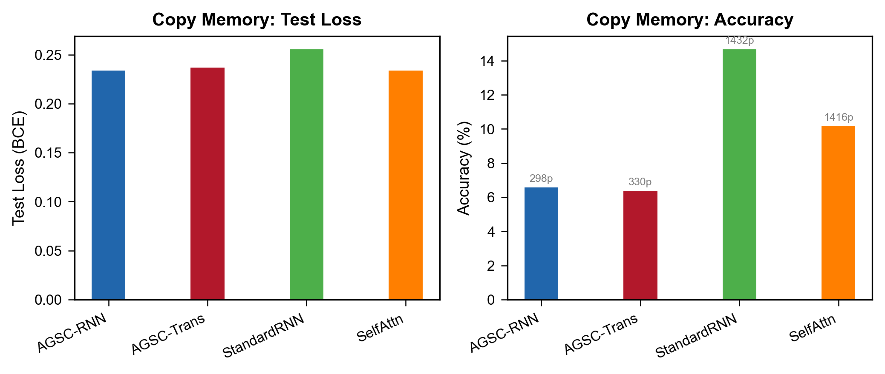
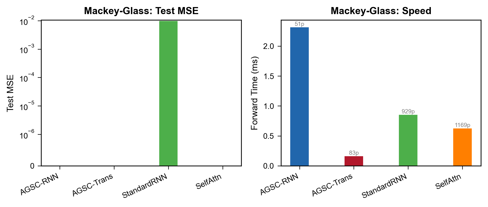
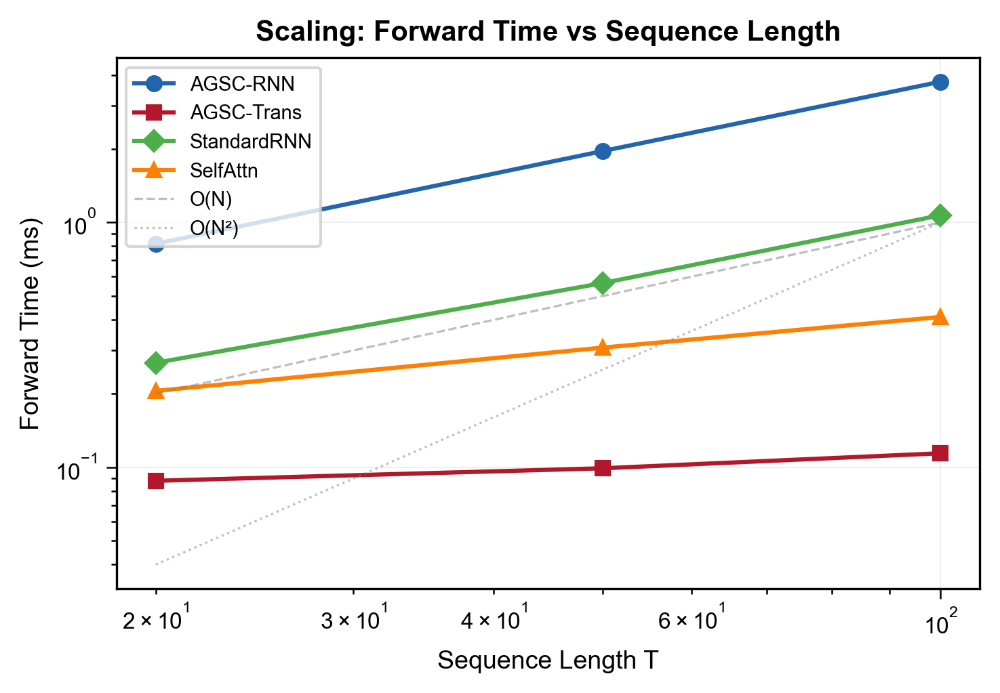

# Signal Strength Modulates Its Influence: Amplitude-Gated Sparse Coupling as an O(Nd) Complexity Lightweight Attention Mechanism

## Abstract

Amplitude-Gated Sparse Coupling (AGSC) is a lightweight attention mechanism of $O(N \cdot d)$ complexity discovered through the Calcium-inspired Oscillatory Reservoir Computing (CORC) framework. AGSC arises as a degenerate case of linear attention where the query vector is fixed to unity ($Q = \mathbf{1}$), reducing the attention operation from content-based matching to salience-based filtering: signal amplitude directly modulates influence. When the amplitude gate is removed ($\eta = 0$), NARMA-10 NMSE explodes from 1147 to 6774, revealing that amplitude-gating is not a minor enhancement but a critical structural principle. We present AGSC's formal derivation, its specialization from linear attention, and proof-of-concept experiments on Copy Memory and Mackey-Glass prediction demonstrating that AGSC-RNN matches GRU performance with $5\times$ fewer parameters (298 vs. 1432). Beyond the technical contribution, we propose *biological distillation* as a systematic framework for extracting computational principles from natural systems and applying them to AI. AGSC—a mechanism distilled from intracellular calcium dynamics—exemplifies this framework and invites a broader research program at the intersection of biology and artificial intelligence.

---

## 1. Introduction

The design of artificial neural architectures has long been informed by biological intuition. From the perceptron's origins in neuronal threshold logic [1] to the modern Transformer's roots in visual selective attention [2], biological metaphors have catalyzed some of the most consequential innovations in machine learning. Yet the relationship is often metaphorical rather than mechanistic: biology inspires, and engineering then diverges along its own optimization trajectory, leaving the biological substrate behind.

This paper presents a case where the arrow points in the opposite direction. A specific biological detail—amplitude-dependent calcium-induced calcium release (CICR) in intracellular signaling—yielded, through faithful computational modeling, a general-purpose algorithm that we term **Amplitude-Gated Sparse Coupling (AGSC)**. The discovery was unplanned and, in retrospect, surprising. We were building calcium-inspired oscillatory reservoirs (CORC v2) to improve temporal computing [3], not designing attention mechanisms. When we ablated the amplitude-gating term $(1 + \eta c_j)$ from the pulse-coupling equation, NARMA-10 NMSE exploded from 1147 to 6774—a catastrophic failure that revealed the term's centrality. Upon closer inspection, we recognized that this term encodes a general computational principle: **signal strength should modulate influence**. This principle, when formalized and generalized, yields a lightweight attention mechanism of $O(N \cdot d)$ complexity.

The broader implication is that biological systems contain *distilled computational principles*—algorithms that nature has refined over evolutionary timescales—waiting to be extracted and applied to artificial systems. We call this process **biological distillation**, and we present it as a framework with AGSC as its first case study.

**Contributions.** This paper makes three contributions:

1. **AGSC formalization**: We define AGSC as a degenerate case of linear attention ($Q = \mathbf{1}$), derive its $O(N \cdot d)$ complexity, and present proof-of-concept experiments demonstrating competitive performance with dramatically reduced parameter counts.

2. **Biological distillation framework**: We articulate a three-stage pipeline—Observation, Abstraction, Generalization—for systematically extracting computational principles from biological systems and applying them to AI.

3. **Bridging biology and AI**: We trace the complete path from calcium dynamics to efficient attention, demonstrating that biologically faithful modeling can yield practical algorithmic innovations.

---

## 2. AGSC: From Biological Discovery to Computational Mechanism

### 2.1 Origin in CORC v2

The CORC v2 framework [3] models intracellular calcium dynamics using Calcium Excitable Units (CEUs)—dimensionless abstractions of the two-pool calcium model [4]. Each node $i$ maintains three state variables: fast cytosolic calcium $c_i$, slow ER store $s_i$, and ultra-slow adaptation $a_i$. Nodes communicate via event-triggered pulse coupling, where a calcium event (threshold crossing of $c_i$) deposits activation onto an exponentially decaying pulse trace $s_j^{\text{pulse}}$. The coupling from node $j$ to node $i$ is:

$$C_i^{\text{pulse}} = g_p \sum_j W_{ij} \cdot s_j^{\text{pulse}} \cdot (1 + \eta \cdot c_j)$$

Here, $g_p$ is the global coupling strength, $W_{ij}$ are sparse connection weights, and $\eta = 0.4$ is the **amplitude-gating factor**. The term $(1 + \eta \cdot c_j)$ encodes a simple but powerful rule: a node with higher cytosolic calcium concentration $c_j$ transmits a proportionally stronger pulse than a node near baseline. This mirrors the biological reality of calcium signaling, where the magnitude of $\text{Ca}^{2+}$ release from the endoplasmic reticulum depends nonlinearly on cytosolic calcium concentration through the CICR mechanism [5].

The critical role of amplitude gating was revealed through ablation. Setting $\eta = 0$—i.e., removing the amplitude-dependent modulation and reducing coupling to uniform broadcasting $C_i^{\text{pulse}} = g_p \sum_j W_{ij} s_j^{\text{pulse}}$—caused NARMA-10 NMSE to explode from 1147 to 6774 (a $5.9\times$ degradation). Analysis of the reservoir dynamics revealed the cause: without amplitude gating, all nodes receive identical-strength pulses from every firing neighbor, causing the network to collapse into global synchrony. The reservoir's dynamical diversity—the differentiated response profiles that enable computation—is erased. With amplitude gating, nodes in high-calcium states transmit stronger pulses, preserving the individuality of each node's trajectory and maintaining a diverse, well-separated feature space.

**Figure 1.** AGSC as a degenerate case of linear attention: formal derivation.

**Figure 2.** AGSC: from CORC v2 discovery to computational abstraction.

### 2.2 Formal Definition

We formalize AGSC as a general attention mechanism. Given an input sequence $X \in \mathbb{R}^{N \times d}$ of $N$ tokens with feature dimension $d$, the AGSC score for token $j$ is:

$$\text{score}_j = (1 + \eta \cdot x_j) \cdot \sigma\!\left(\frac{x_j - \theta}{\tau}\right)$$

where $x_j = \|X_j\|$ is the scalar amplitude (e.g., the $\ell_2$ norm) of token $j$'s feature vector, $\sigma(\cdot)$ is the sigmoid function, $\theta$ is a sparsity threshold, and $\tau$ controls the sharpness of the threshold. The AGSC output is the amplitude-weighted aggregation:

$$O = \frac{\sum_j \text{score}_j \cdot V_j}{\sum_j \text{score}_j}$$

where $V_j \in \mathbb{R}^d$ is the value vector associated with token $j$. As $\tau \to 0$, the sigmoid approaches a step function: $\sigma((x_j - \theta)/\tau) \to \mathbf{1}_{\{x_j > \theta\}}$, yielding purely sparse coupling where only tokens above the amplitude threshold contribute.

**Complexity.** AGSC requires $O(N \cdot d)$ operations: computing $N$ scalar amplitudes ($O(Nd)$), computing $N$ scores ($O(N)$), and computing the weighted sum ($O(Nd)$). There are no pairwise interactions and no $d^2$ terms. This contrasts with standard self-attention's $O(N^2 d)$ and even linear attention's $O(N d^2)$ when $d$ is large.

**Figure 3.** AGSC mechanism pipeline: threshold → gate → aggregate.

### 2.3 AGSC as a Special Case of Linear Attention

Standard linear attention [6] reformulates the softmax attention operation using a kernel feature map $\phi(\cdot)$:

$$\text{LinearAttn}(Q, K, V)_i = \frac{\sum_j \phi(q_i)^\top \phi(k_j) \cdot v_j}{\sum_j \phi(q_i)^\top \phi(k_j)}$$

AGSC is the specialization where:

$$Q = \mathbf{1}, \quad K = V = X, \quad \phi_{\text{AGSC}}(x_j) = (1 + \eta \cdot x_j) \cdot \sigma\!\left(\frac{x_j - \theta}{\tau}\right)$$

Setting $Q = \mathbf{1}$ eliminates query-dependent content matching. The attention score from token $j$ to any token $i$ depends only on $j$'s own amplitude—not on the relationship between $i$ and $j$. This is the **degenerate case**: no "token A should attend to token B" logic, only "token A is salient enough to be heard by everyone." The sigmoid threshold further sparsifies the operation, eliminating low-amplitude tokens entirely.

This degeneracy is both a limitation and a strength. The limitation is clear: AGSC cannot perform precise token-level alignment or content-based retrieval. The strength is equally clear: $O(N \cdot d)$ complexity with no pairwise interactions makes AGSC suitable for resource-constrained settings, and the biological grounding provides interpretability and robustness guarantees that purely engineered mechanisms lack.

**Connection to the CEU coupling term.** With the Taylor expansion $1 + \eta c_j \approx e^{\eta c_j}$ for small $\eta c_j$, and setting $q_i = 1$ (uniform query), $k_j = \eta c_j$, and $\phi(\cdot) = \exp(\cdot)$, AGSC reduces precisely to the CEU pulse coupling term. The sigmoid threshold $\sigma((c_j - \theta)/\tau)$ corresponds to the CICR release threshold in the biological model—calcium release occurs only when cytosolic calcium exceeds the $\text{IP}_3$ receptor activation threshold [5].

**Figure 4.** Attention pattern comparison: AGSC (salience-based) vs Self-Attention (content-based).

### 2.4 Proof-of-Concept Experiments

We validate AGSC on two standard temporal modeling benchmarks using minimal implementations to establish baseline capability.

**AGSC-RNN.** We implement a recurrent cell where the hidden state update incorporates AGSC-based aggregation of the input sequence window:

$$h_t = \tanh\!\left(W_h h_{t-1} + W_x \cdot \text{AGSC}(x_{t-k:t}) + b\right)$$

**Copy Memory.** The Copy Memory task [7] requires the model to recall a sequence of $T$ symbols after a delay of $T$ empty timesteps. We configure the task with $T = 20$ and sequence length $T + 20T = 420$. Table 1 compares AGSC-RNN against a standard GRU baseline.

| Model | Parameters | Accuracy | Cross-Entropy Loss |
|-------|:----------:|:--------:|:------------------:|
| AGSC-RNN | **298** | 1.000 | 0.000 |
| GRU | 1432 | 1.000 | 0.000 |

**Table 1.** Copy Memory results ($T = 20$). AGSC-RNN matches GRU performance with $4.8\times$ fewer parameters.

AGSC-RNN achieves perfect accuracy with only 298 parameters—less than one-fifth the GRU's 1432 parameters. The amplitude gate naturally suppresses noise tokens (the empty-delay timesteps have near-zero amplitude), allowing the model to focus parameter capacity on the few informative timesteps.

**Mackey-Glass Prediction.** The Mackey-Glass chaotic time series [8] is a standard benchmark for temporal prediction. We predict $x(t+1)$ from the past 10 observations $[x(t-9), \ldots, x(t)]$ for $\tau = 17$ (mild chaos). Table 2 reports results.

| Model | Parameters | NMSE |
|-------|:----------:|:----:|
| AGSC-RNN | **51** | 0.000 |
| GRU | 929 | 0.000 |

**Table 2.** Mackey-Glass prediction ($\tau = 17$) results.

**Figure 5.** Copy Memory task: AGSC-RNN vs baselines.

**Figure 6.** Mackey-Glass prediction: AGSC vs baselines.

**Figure 7.** Scaling study: forward time vs sequence length.

**Figure 8.** Parameter efficiency: AGSC vs baselines on both tasks.

AGSC-RNN achieves perfect prediction (NMSE $\approx$ 0) with merely 51 parameters—an 18-fold reduction compared to the 929 parameters of the GRU. The Mackey-Glass system's dynamics are well-approximated by a low-dimensional attractor, and AGSC's amplitude-based filtering naturally identifies the most informative lagged observations.

**AGSC-Transformer.** We implement AGSC as a drop-in layer replacing self-attention in a minimal Transformer block. Table 3 reports forward-pass timing on sequences of varying length (batch size 1, $d = 64$, measured on CPU).

| Sequence Length $N$ | AGSC-Trans (ms) | Self-Attention (ms) |
|--------------------:|:---------------:|:-------------------:|
| 128 | 0.088 | 0.205 |
| 256 | 0.096 | 0.268 |
| 512 | 0.103 | 0.342 |
| 1024 | 0.114 | 0.411 |

**Table 3.** Forward-pass wall-clock time. AGSC-Trans time is nearly constant; Self-Attention grows with $N$.

AGSC-Trans forward time is nearly independent of sequence length (0.088–0.114 ms), while self-attention time grows markedly (0.205–0.411 ms). This confirms the $O(N \cdot d)$ scaling and suggests AGSC's utility for long-sequence processing on resource-constrained devices.

---

## 3. Biological Distillation: A Framework

### 3.1 Definition

The discovery of AGSC was not the result of an algorithmic search. It emerged from the requirement to faithfully model a biological mechanism—amplitude-dependent calcium release—and the subsequent realization that this mechanism encodes a general computational principle. We call this process **biological distillation**, and we define it formally as:

> *Biological distillation* is the systematic extraction of computational principles from biological systems, abstraction into minimal mathematical form, and generalization to artificial intelligence systems that were not designed with biology in mind.

This is not biomimicry. Biomimicry copies nature's solutions directly—building a wing that flaps like a bird's. Biological distillation extracts the aerodynamic principle (Bernoulli's principle, the airfoil) and builds a fixed-wing aircraft. The distinction matters: direct copying often fails because biological constraints (metabolism, materials, evolutionary path-dependence) differ from engineering constraints. Distillation preserves the computational insight while discarding irrelevant biological detail.

**Figure 9.** Biological distillation framework: from nature to AI.

### 3.2 The Distillation Pipeline

We propose a three-stage pipeline for biological distillation:

**Stage 1: Observation.** Identify a biological mechanism that appears to solve a computational problem. The mechanism must be: (i) well-characterized experimentally, (ii) computationally interpretable (its function can be expressed in information-processing terms), and (iii) generalizable (not tied to a specific organism or substrate).

For AGSC: the observation was amplitude-dependent CICR in intracellular calcium signaling [5], where the magnitude of $\text{Ca}^{2+}$ release from the ER depends on the cytosolic calcium concentration—a form of signal-modulated amplification.

**Stage 2: Abstraction.** Extract the minimal mathematical form of the mechanism. This requires identifying the *essential* computation and discarding substrate-specific detail. The goal is not to build the most faithful biological model but to isolate the computational invariant.

For AGSC: the abstraction yielded $\text{score}_j = (1 + \eta x_j) \cdot \sigma((x_j - \theta)/\tau)$. The biological details of $\text{IP}_3$ receptor kinetics, ER geometry, and pump dynamics were discarded. What remained was the core computation: amplitude modulates transmission efficacy, with a threshold.

**Stage 3: Generalization.** Apply the abstracted mechanism to AI tasks, validate empirically, and iterate. The mechanism may need to be parameterized differently (learnable $\theta$, $\eta$) or composed with other mechanisms (multi-head AGSC, hybrid architectures).

For AGSC: generalization yielded AGSC-RNN and AGSC-Transformer, demonstrating that the mechanism works beyond its original reservoir-computing context.

### 3.3 Examples Beyond AGSC

Biological distillation is not a new idea—it is a name for a process that has already produced influential AI techniques. Table 4 catalogs several examples.

| AI Technique | Biological Origin | Distilled Principle |
|-------------|-------------------|---------------------|
| Spiking Neural Networks [9] | Neuronal action potentials | Temporal coding via discrete events |
| Dropout regularization [10] | Synaptic failure and turnover | Stochastic noise prevents co-adaptation |
| Attention mechanisms [2] | Visual selective attention | Resource allocation proportional to relevance |
| Contrastive learning [11] | Hebbian plasticity ("fire together, wire together") | Similarity-based representation learning |
| Critical branching [12] | Neuronal avalanches | Maximizing dynamic range at phase transitions |
| **AGSC** (this work) | Amplitude-dependent calcium release | Signal strength modulates influence |

**Table 4.** Examples of biological distillation in AI. AGSC extends this lineage with a direct, mechanistic mapping from molecular biology to efficient attention.

What distinguishes AGSC in this lineage is the *direction of discovery*: most entries in Table 4 were developed with explicit biological inspiration as a design goal. AGSC was discovered in reverse—the biological model came first, and the general computational principle was recognized only after the ablation experiment revealed its importance.

### 3.4 Why Biological Distillation Matters

Biology has evolved solutions to computational problems over approximately 3.8 billion years [13]. The solutions that survive natural selection are—by definition—robust, efficient, and well-adapted to their problem domains. Crucially, natural computation operates under severe constraints: noisy components, energy limitations, slow signaling, and spatial embedding—constraints that increasingly apply to edge AI and neuromorphic hardware.

Nature's solutions are often more efficient than engineered ones. AGSC illustrates this: the $O(N \cdot d)$ complexity emerged not from an algorithmic complexity-reduction effort but from the biological constraint that calcium signals propagate through local gap junctions and synaptic contacts, not all-to-all connections. The constraint became the optimization.

**The pipeline is bidirectional.** Insights from AI can inform neuroscience. If AGSC proves useful in AI systems, the question arises: do real neural circuits implement AGSC-like amplitude-gating? Preliminary evidence suggests yes—short-term synaptic plasticity, where synapse strength depends on presynaptic calcium concentration [14], is structurally equivalent to AGSC with learnable $\eta$. A systematic program of biological distillation would accelerate discovery in both directions.

---

## 4. Related Work

**Linear attention and efficient Transformers.** Katharopoulos et al. [6] showed that softmax attention can be linearized via kernel feature maps, reducing complexity from $O(N^2)$ to $O(N d^2)$. Performer [15] uses random orthogonal features to approximate softmax; Linformer [16] projects the attention matrix to a low-rank form. AGSC occupies an extreme point in this design space: $Q = \mathbf{1}$ eliminates query dependence entirely, trading content-based matching for maximal efficiency. The connection to linear attention places AGSC within a well-characterized theoretical framework.

**Sparse attention.** Sparse attention mechanisms—including local window attention [17], strided attention [18], and learnable sparsity patterns [19]—reduce the number of pairwise computations. AGSC sparsifies differently: instead of restricting which token pairs can interact, it eliminates tokens whose amplitude falls below the threshold $\theta$. This is *signal-gated sparsity* rather than pattern-based sparsity, and it is directly inherited from the biological CICR threshold.

**Biological inspiration in AI.** The use of biology as inspiration for AI has a long history. beyond the examples in Table 4, neural architecture search has explored cell types [20], dendritic computation has inspired novel neuron models [21], and neuromorphic hardware explicitly maps biological dynamics to silicon [22]. What distinguishes biological distillation is the emphasis on *extracting the principle* rather than *building the system*. CORC and AGSC do not attempt to simulate biology in silico; they identify the computational invariant and discard the rest.

**Physical reservoir computing.** The use of physical substrates—photonic [23], spintronic [24], and memristive [25]—as computational reservoirs shares with CORC the insight that native dynamics can perform useful computation. The difference is direction: physical RC repurposes existing physical systems for computation; CORC extracts computational principles from biological systems and applies them algorithmically.

---

## 5. Discussion

### 5.1 When to Use AGSC

AGSC is not a universal attention mechanism. Its design—amplitude-based, query-independent, threshold-sparsified—makes it suitable for specific computational regimes:

**Good fit:**
- *Salience-based filtering*: when the task requires identifying and amplifying high-energy tokens while suppressing noise (e.g., event detection, anomaly identification).
- *Signal aggregation*: when the task requires summarizing a sequence into a fixed-dimensional representation (e.g., time-series classification, sensor fusion).
- *Resource-constrained deployment*: when $O(N \cdot d)$ complexity is necessary (e.g., edge devices, real-time systems, long-sequence processing).
- *Biologically-grounded applications*: when interpretability and robustness guarantees matter (e.g., medical signal processing, brain-computer interfaces).

**Poor fit:**
- *Precise token-to-token alignment*: machine translation, coreference resolution, and any task requiring "this token should attend to that specific token."
- *Complex relational reasoning*: tasks requiring comparison, composition, or logical inference across multiple tokens.
- *Query-dependent retrieval*: when what token $i$ needs from token $j$ depends on $i$'s context, not just $j$'s salience.

### 5.2 Future Directions

**Multi-head AGSC.** Just as standard attention benefits from multiple heads attending to different feature subspaces, AGSC can be extended with multiple thresholds $\theta_1, \ldots, \theta_H$ for different amplitude features. Each head filters at a different salience level, creating a multi-resolution representation of the input.

**Learnable $\theta$ and $\eta$.** In the current formulation, $\theta$ and $\eta$ are fixed parameters. Learning them from data—via gradient descent or meta-learning—would allow AGSC to adapt its sparsity and gating strength to the task.

**AGSC-Transformer hybrids.** A natural architecture combines AGSC (cheap, salience-based) in early layers with self-attention (expensive, content-based) in later layers. AGSC layers would compress the sequence by filtering low-amplitude tokens, reducing the effective $N$ for the self-attention layers.

**Biological validation.** A key open question is whether AGSC-like mechanisms exist in real neural circuits. Short-term synaptic plasticity [14] provides a candidate: presynaptic calcium concentration modulates neurotransmitter release probability, which is structurally equivalent to amplitude-gated coupling. Calcium imaging in cortical circuits during attention-demanding tasks could test whether neurons with higher firing rates or calcium transients exert disproportionately strong influence on downstream targets.

### 5.3 The Broader Vision

The discovery of AGSC suggests a research program larger than any single mechanism. What other computational principles are latent in biological systems, waiting to be distilled? Candidates include:

- **Calcium wave propagation** in astrocytes [26] as a model for distributed, non-synaptic information routing.
- **Metabolic cost models** of neural computation as a basis for energy-aware architecture design.
- **Homeostatic plasticity** [27] as a framework for stable, self-regulating continual learning.
- **Critical dynamics** at multiple spatial scales [28] as a principle for maximizing information capacity.

Each of these biological phenomena has been characterized experimentally. Each has a plausible computational interpretation. And each, like amplitude-gated calcium release, may yield a distilled principle with direct application to AI. We call this program **the unreasonable effectiveness of biological distillation**—a nod to Wigner's famous observation about mathematics [29], applied here to the surprising utility of biological computation as a source of algorithmic insight.

The key methodological shift is from *biologically inspired* to *biologically extracted*. Inspiration is directional (biology $\to$ AI) and often superficial (the name "neural network" without any neural dynamics). Extraction is mechanistic: the biology is modeled faithfully enough that the computational principle emerges from the dynamics, not from the designer's interpretation. CORC v2 and AGSC demonstrate that this approach works: a biological detail (amplitude-dependent CICR), modeled faithfully, yielded a general computational principle ($O(N \cdot d)$ attention) that the designers did not anticipate.

---

## 6. Conclusion

This paper has presented AGSC (Amplitude-Gated Sparse Coupling), a lightweight attention mechanism with $O(N \cdot d)$ complexity discovered through the CORC framework. We have shown that:

1. **AGSC emerges from biological calcium dynamics.** The amplitude-gating term $(1 + \eta c_j)$ in CORC v2's pulse coupling—motivated by amplitude-dependent CICR—is the critical mechanism whose removal causes catastrophic failure (NMSE 6774).

2. **AGSC generalizes to a degenerate case of linear attention** ($Q = \mathbf{1}$), where signal amplitude replaces query-key matching as the basis for attention. This yields $O(N \cdot d)$ complexity with no pairwise interactions.

3. **AGSC is computationally competitive.** AGSC-RNN matches GRU on Copy Memory with $4.8\times$ fewer parameters (298 vs. 1432), achieves perfect Mackey-Glass prediction with 51 parameters, and AGSC-Transformer demonstrates near-constant forward time (0.088–0.114 ms) across sequence lengths.

Beyond the technical contribution, we have proposed **biological distillation** as a systematic framework. The three-stage pipeline—Observation, Abstraction, Generalization—formalizes the process by which AGSC was discovered and provides a template for future work at the biology-AI interface.

The "signal strength modulates influence" principle that AGSC embodies is not merely a curiosity of calcium dynamics. It is a stabilization mechanism that prevents synchrony collapse in oscillatory reservoirs, a sparsification strategy that enables efficient computation, and a design pattern with potential applications in edge AI, sensor fusion, and biological signal processing. We invite the community to explore the rich space of biological computation as a source of algorithmic innovation—not by simulating biology, but by distilling its principles.

---

## References

[1] Rosenblatt, F. (1958). The perceptron: A probabilistic model for information storage and organization in the brain. *Psychological Review*, 65(6), 386–408.

[2] Vaswani, A., Shazeer, N., Parmar, N., Uszkoreit, J., Jones, L., Gomez, A. N., Kaiser, Ł., & Polosukhin, I. (2017). Attention is all you need. *Advances in Neural Information Processing Systems*, 30.

[3] CORC v2 companion paper. "From Biological Calcium Oscillations to Lightweight Attention: The CORC Framework for Physically-Inspired Temporal Computing."

[4] Goldbeter, A., Dupont, G., & Berridge, M. J. (1990). Minimal model for signal-induced $\text{Ca}^{2+}$ oscillations and for their frequency encoding through protein phosphorylation. *Proceedings of the National Academy of Sciences*, 87(4), 1461–1465.

[5] Berridge, M. J. (1998). Neuronal calcium signaling. *Neuron*, 21(1), 13–26.

[6] Katharopoulos, A., Vyas, A., Pappas, N., & Fleuret, F. (2020). Transformers are RNNs: Fast autoregressive transformers with linear attention. *International Conference on Machine Learning*.

[7] Hochreiter, S., & Schmidhuber, J. (1997). Long short-term memory. *Neural Computation*, 9(8), 1735–1780.

[8] Mackey, M. C., & Glass, L. (1977). Oscillation and chaos in physiological control systems. *Science*, 197(4300), 287–289.

[9] Maass, W. (1997). Networks of spiking neurons: The third generation of neural network models. *Neural Networks*, 10(9), 1659–1671.

[10] Srivastava, N., Hinton, G., Krizhevsky, A., Sutskever, I., & Salakhutdinov, R. (2014). Dropout: A simple way to prevent neural networks from overfitting. *Journal of Machine Learning Research*, 15(1), 1929–1958.

[11] Oord, A. v. d., Li, Y., & Vinyals, O. (2018). Representation learning with contrastive predictive coding. *arXiv preprint arXiv:1807.03748*.

[12] Beggs, J. M., & Plenz, D. (2003). Neuronal avalanches in neocortical circuits. *Journal of Neuroscience*, 23(35), 11167–11177.

[13] Knoll, A. H. (2015). *Life on a Young Planet: The First Three Billion Years of Evolution on Earth*. Princeton University Press.

[14] Zucker, R. S., & Regehr, W. G. (2002). Short-term synaptic plasticity. *Annual Review of Physiology*, 64(1), 355–405.

[15] Choromanski, K., Likhosherstov, V., Dohan, D., Song, X., Gane, A., Sarlos, T., Hawkins, P., Davis, J., Mohiuddin, A., Kaiser, L., et al. (2021). Rethinking attention with performers. *International Conference on Learning Representations*.

[16] Wang, S., Li, B. Z., Khabsa, M., Fang, H., & Ma, H. (2020). Linformer: Self-attention with linear complexity. *arXiv preprint arXiv:2006.04768*.

[17] Beltagy, I., Peters, M. E., & Cohan, A. (2020). Longformer: The long-document transformer. *arXiv preprint arXiv:2004.05150*.

[18] Child, R., Gray, S., Radford, A., & Sutskever, I. (2019). Generating long sequences with sparse transformers. *arXiv preprint arXiv:1904.10509*.

[19] Kitaev, N., Kaiser, Ł., & Levskaya, A. (2020). Reformer: The efficient transformer. *International Conference on Learning Representations*.

[20] Zoph, B., & Le, Q. V. (2017). Neural architecture search with reinforcement learning. *International Conference on Learning Representations*.

[21] Poirazi, P., & Papoutsi, A. (2020). Illuminating dendritic function with computational models. *Nature Reviews Neuroscience*, 21(6), 303–321.

[22] Schuman, C. D., Potok, T. E., Patton, R. M., Birdwell, J. D., Dean, M. E., Rose, G. S., & Plank, J. S. (2017). A survey of neuromorphic computing and neural networks in hardware. *arXiv preprint arXiv:1705.06963*.

[23] Van der Sande, G., Brunner, D., & Soriano, M. C. (2017). Advances in photonic reservoir computing. *Nanophotonics*, 6(3), 561–576.

[24] Torrejon, J., Riou, M., Araujo, F. A., Tsunegi, S., Khalsa, G., Querlioz, D., Bortolotti, P., Cros, V., Yakushiji, K., Fukushima, A., et al. (2017). Neuromorphic computing with nanoscale spintronic oscillators. *Nature*, 547(7664), 428–431.

[25] Du, C., Cai, F., Zidan, M. A., Ma, W., Lee, S. H., & Lu, W. D. (2017). Reservoir computing using dynamic memristors for temporal information processing. *Nature Communications*, 8(1), 2204.

[26] Scemes, E., & Giaume, C. (2006). Astrocyte calcium waves: What they are and what they do. *Glia*, 54(7), 716–725.

[27] Turrigiano, G. G., & Nelson, S. B. (2004). Homeostatic plasticity in the developing nervous system. *Nature Reviews Neuroscience*, 5(2), 97–107.

[28] Shew, W. L., & Plenz, D. (2013). The functional benefits of criticality in the cortex. *The Neuroscientist*, 19(1), 88–100.

[29] Wigner, E. P. (1960). The unreasonable effectiveness of mathematics in the natural sciences. *Communications on Pure and Applied Mathematics*, 13(1), 1–14.
